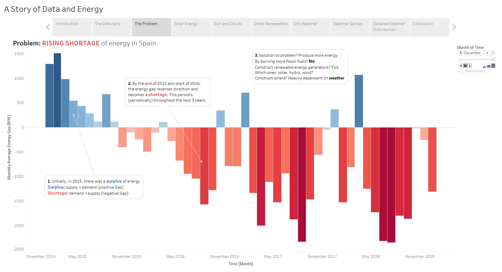

# Tableau Storyboard - A Story of Data and Energy in Spain

This repository contains Part A and Part B of the assignments that I did for 
the Advanced Business Analytics and Visualization module.

Part A is a document where I set out the context and introduce the business
aim and objectives of a particular company and how to achieve them. These objectives
do not represent the actual business goals of the company in question, and
were only invented as part of the assignment. Part A (20%) was completed on 26-July-2020.

For Part B, I constructed a storyboard on Tableau and recorded a video presentation
to tell a story about it. This storyboard can be found on my [Tableau Public profile page](https://public.tableau.com/profile/ismail.dawoodjee#!/vizhome/AssignmentB_16023178509100/Story1).
Part B (30%) was completed on 4-September-2020 and the storyboard was uploaded on 10-October-2020.

Part C involved using SAS Enterprise Miner, in which I produced forecasts for electricity
price and load, performed time series similarity analysis and cluster analysis between weather
and energy variables for each city. Part C (50%) was completed on 21-September-2020.

Unfortunately, some slides in the Public storyboard appear jumbled up, with mispositioned
titles and text boxes. I will try fixing this later, but for now, I included a
non-interactive slide presentation of the storyboard in PDF format for easier readability. 

The datasets I used can be obtained from [Nicholas Jhana's Kaggle page](https://www.kaggle.com/nicholasjhana/energy-consumption-generation-prices-and-weather).
